#### Assignment 4: Recommendations

This assign focuses on ecommendations using generated data. This is part of the prjoct for Data Science course with Prof. Jim Harner. The following code generates a set of 20 users and a set of 20 user-items:

``` r
library(recommenderlab, quietly = TRUE)
set.seed(1)
m <- matrix(sample(c(as.numeric(1:5), NA), 400,
                   replace=TRUE, prob=c(0.05, 0.1, 0.15, 0.1, 0.05, 0.55)),
                   ncol=20,
                   dimnames=list(user=paste("u", 1:20, sep = ""),
                                 item=paste("i", 1:20, sep = "")))

``` r
# The rating matrix can be written externally as a CSV file.
# write.csv(m, "m.csv")
# m.df <- read.csv("m.csv", header = TRUE, row.names = 1)
# head(as.matrix(m.df))
r <- as(m, "realRatingMatrix")
```

#### 1 Create a normalized rating matrix, `r_z`, using *Z*-scores. Inspect the raw rating and Z-normalized ratings using `image()`.

``` r
## Put your R code here.
#Normalization tries to reduce the individual rating bias by row centering the data, i.e., by subtracting from each available rating the mean of the ratings of that user (row). Z-score in addition divides by the standard deviation of the row/column. Normalization can also be done on columns.
r_norm <- normalize(r)
r_norm_image <- image(r_norm,main = "norm ");r_norm_image 
```

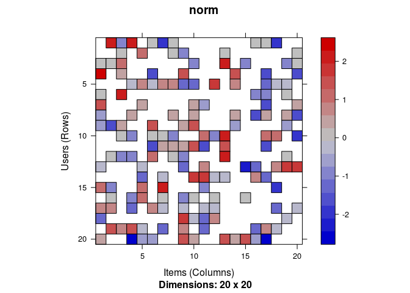

``` r
r_z <- normalize(r, method="Z-score")
r_rawrating <- image(r, main = "Raw Ratings");r_rawrating
```

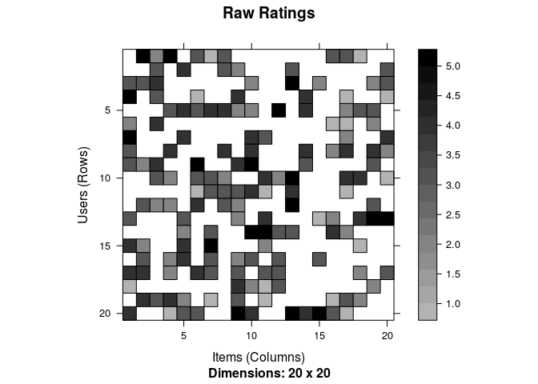

``` r
r_z_image <- image(r_z, main = "ZScore Ratings");r_z_image
```

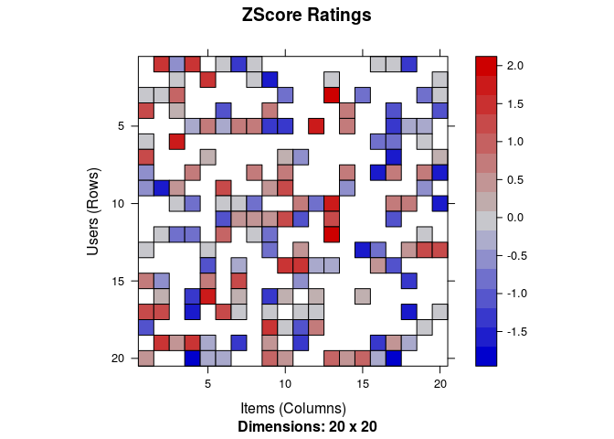

#### 2 Plot the raw and Z-score normalized rating.

``` r
hist(getRatings(r), breaks=100)
```

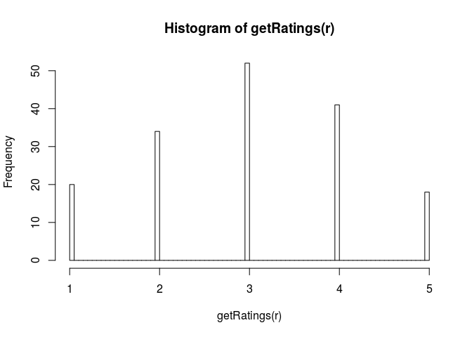

``` r
#hist(getRatings(r_norm), breaks=100)
hist(getRatings(r_z), breaks=100)
```

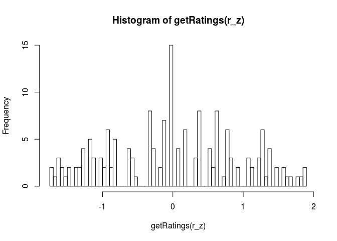

#### 3 Plot the raw user counts and raw item means. Discuss.

``` r
rowCounts(r)
colMeans(r)

``` r
#head(as(r_norm, "list"))
#rowCounts(r_norm[,])
#colMeans(r_norm[,])
hist(rowCounts(r), breaks=50)
```

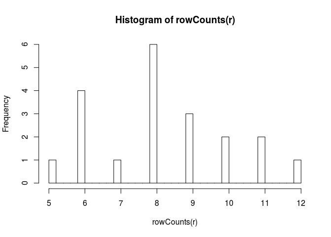

``` r
hist(colMeans(r), breaks=50)
```

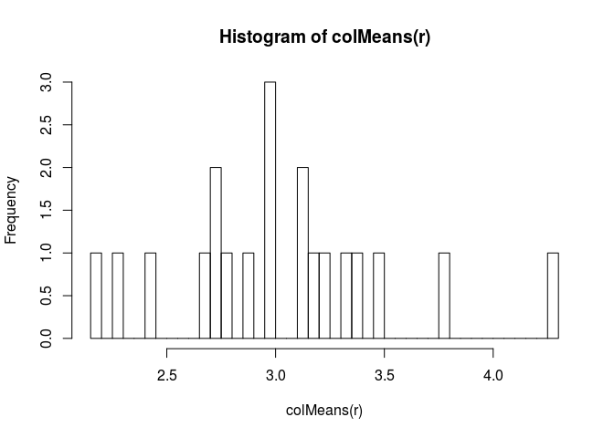

``` r
boxplot(rowCounts(r))
```

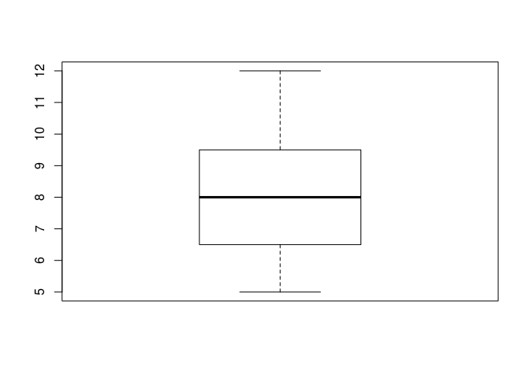

``` r
boxplot(colMeans(r))
```

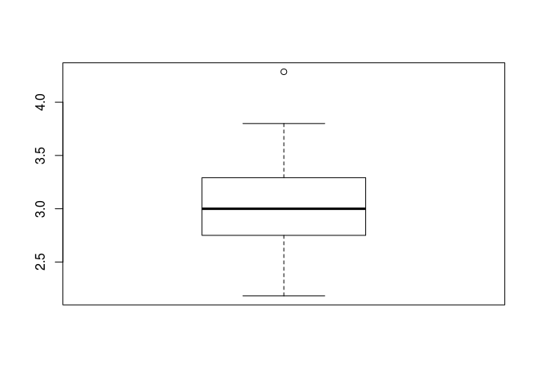

number of items that has been bought are almost equally distributed, around 8.
The mean rate for each item is almost the around 3 

#### 4 Create a recommender based on the popularity of items for the first 15 users using the raw ratings.

``` r
recommenderRegistry$get_entries(dataType = "realRatingMatrix")
r_pop <- Recommender(r[1:15], method = "POPULAR")
names(getModel(r_pop))
```

    ## [1] "topN"                  "ratings"               "normalize"            
    ## [4] "aggregationRatings"    "aggregationPopularity" "verbose"

``` r
r_pop_get <- getModel(r_pop)
recom <- predict(r_pop, r[1:15], n=5) # I didn't know anyother way to show the output other than predicting based on the training data itself.
as(recom,"list")
```

    ## $u1
    ## [1] "i13" "i1"  "i10" "i14" "i5" 
    ## 
    ## $u2
    ## [1] "i1"  "i10" "i14" "i7"  "i19"
    ## 
    ## $u3
    ## [1] "i14" "i5"  "i7"  "i8"  "i4" 
    ## 
    ## $u4
    ## [1] "i13" "i10" "i5"  "i7"  "i8" 
    ## 
    ## $u5
    ## [1] "i13" "i1"  "i3"  "i11" "i2" 
    ## 
    ## $u6
    ## [1] "i13" "i10" "i14" "i5"  "i7" 
    ## 
    ## $u7
    ## [1] "i13" "i14" "i3"  "i7"  "i8" 
    ## 
    ## $u8
    ## [1] "i13" "i3"  "i5"  "i7"  "i12"
    ## 
    ## $u9
    ## [1] "i13" "i5"  "i7"  "i8"  "i4" 
    ## 
    ## $u10
    ## [1] "i1"  "i10" "i14" "i5"  "i19"
    ## 
    ## $u11
    ## [1] "i1"  "i14" "i3"  "i5"  "i19"
    ## 
    ## $u12
    ## [1] "i1"  "i10" "i14" "i5"  "i7" 
    ## 
    ## $u13
    ## [1] "i13" "i10" "i14" "i3"  "i7" 
    ## 
    ## $u14
    ## [1] "i1"  "i14" "i3"  "i8"  "i19"
    ## 
    ## $u15
    ## [1] "i13" "i10" "i14" "i3"  "i8"

#### 5 Create the top-5 recommendation lists for the last five users.

``` r
r_lastpop <- Recommender(r[(length(rownames(r))-4):length(rownames(r))], method = "POPULAR") # if this question meant that based on the first 15 data, find the recommendations for the last five then I would have used this line  instead r_lastpop <- Recommender(r[1:(length(rownames(r))-5)], method = "POPULAR")

#r_lastpop; getModel(r_lastpop)
r_last_recom <- predict(r_lastpop, r[(length(rownames(r))-4):length(rownames(r))] )
as(r_last_recom,"list") 
```

    ## $u16
    ##  [1] "i13" "i3"  "i14" "i6"  "i1"  "i8"  "i20" "i19" "i18" "i16"
    ## 
    ## $u17
    ##  [1] "i15" "i13" "i3"  "i14" "i10" "i5"  "i8"  "i19" "i16" "i17"
    ## 
    ## $u18
    ##  [1] "i2"  "i15" "i13" "i3"  "i14" "i6"  "i5"  "i8"  "i20" "i7" 
    ## 
    ## $u19
    ##  [1] "i15" "i13" "i12" "i14" "i10" "i6"  "i1"  "i8"  "i20" "i19"
    ## 
    ## $u20
    ## [1] "i2"  "i12" "i3"  "i8"  "i20" "i19" "i7"  "i18" "i11"

``` r
r_last_best <- bestN(r_last_recom,n=5)
as(r_last_best,"list")
```

    ## $u16
    ## [1] "i13" "i3"  "i14" "i6"  "i1" 
    ## 
    ## $u17
    ## [1] "i15" "i13" "i3"  "i14" "i10"
    ## 
    ## $u18
    ## [1] "i2"  "i15" "i13" "i3"  "i14"
    ## 
    ## $u19
    ## [1] "i15" "i13" "i12" "i14" "i10"
    ## 
    ## $u20
    ## [1] "i2"  "i12" "i3"  "i8"  "i20"

#### 6 Create an evaluation scheme which splits the 20 users into a training set (75%) and a test set (25%). For the test set 5 items will be given to the recommender algorithm and the other items will be held out for computing the error. Use a `goodRating` value of 3.

``` r
e <- evaluationScheme(r, method="split", train=0.75, given=5, goodRating=3);e
```

    ## Evaluation scheme with 5 items given
    ## Method: 'split' with 1 run(s).
    ## Training set proportion: 0.750
    ## Good ratings: >=3.000000
    ## Data set: 20 x 20 rating matrix of class 'realRatingMatrix' with 165 ratings.

``` r
# train.r <- r[sample,]
# test.r <- r[-sample,]
# r.train <- Recommender(train.r[1:5], method = "POPULAR")
# recom <- predict(r.train, train.r[6:15] ,n=5)
# as(recom, "list")
# e <- evaluationScheme(test.r, method="split", train=0.75, given=5, goodRating=3);e
```

#### 7 Create two recommenders (user-based "UBCF" and item-based collaborative filtering "IBCF"") using the training data. Compute predicted ratings for the known part of the test data (5 items for each user) using the two algorithms. Calculate the error (RMSE, MSE, and MAE) between the prediction and the unknown part of the test data. Discuss.

``` r
r1 <- Recommender(getData(e, "train"), "UBCF");r1 #How can I take a look at its values? as(r,"list") is not working
```

    ## Recommender of type 'UBCF' for 'realRatingMatrix' 
    ## learned using 15 users.

``` r
r2 <- Recommender(getData(e, "train"), "IBCF")
p1 <- predict(r1, getData(e, "known"), type="ratings")
p2 <- predict(r2, getData(e, "known"), type="ratings")
error <- rbind(calcPredictionAccuracy(p1, getData(e, "unknown")),calcPredictionAccuracy(p2,getData(e,"unknown")))
rownames(error) <- c("UBCF","IBCF")
error
```

    ##          RMSE      MSE      MAE
    ## UBCF 1.412844 1.996130 1.168503
    ## IBCF 1.968444 3.874771 1.620307

``` r
# In this case IBCF produces smaller prediction error
```

#### 8 create a 5-fold cross validation scheme with the the Given-5 protocol, i.e., for the test users all but five randomly selected items are withheld for evaluation. Compute the average confusion matrix.

``` r
scheme <- evaluationScheme(r, method="cross", k=5, given=5,goodRating=3) # when I set given to 5 then confusion matrix get incorrect
scheme
```

    ## Evaluation scheme with 5 items given
    ## Method: 'cross-validation' with 5 run(s).
    ## Good ratings: >=3.000000
    ## Data set: 20 x 20 rating matrix of class 'realRatingMatrix' with 165 ratings.

``` r
sample5 <- sample(1:20, .75*20)
results <- evaluate(scheme, method="POPULAR", n=sort(sample(sample5,5)))
```

    ## POPULAR run fold/sample [model time/prediction time]
    ##   1  [0.004sec/0.012sec] 
    ##   2  [0.004sec/0.012sec] 
    ##   3  [0.004sec/0.012sec] 
    ##   4  [0.004sec/0.012sec] 
    ##   5  [0.004sec/0.012sec]

``` r
results
```

    ## Evaluation results for 5 folds/samples using method 'POPULAR'.

``` r
getConfusionMatrix(results)[[1]]
```

    ##      TP    FP   FN    TN precision    recall       TPR        FPR
    ## 1  0.00  1.00 3.50 10.50 0.0000000 0.0000000 0.0000000 0.08779138
    ## 5  1.25  3.75 2.25  7.75 0.2500000 0.3583333 0.3583333 0.32389277
    ## 11 3.00  8.00 0.50  3.50 0.2727273 0.8666667 0.8666667 0.69466783
    ## 17 3.50 11.50 0.00  0.00 0.2333333 1.0000000 1.0000000 1.00000000
    ## 20 3.50 11.50 0.00  0.00 0.2333333 1.0000000 1.0000000 1.00000000

``` r
avg(results)
```

    ##      TP    FP   FN    TN precision     recall        TPR        FPR
    ## 1  0.20  0.80 2.15 11.85 0.2000000 0.09722222 0.09722222 0.06389527
    ## 5  0.95  4.05 1.40  8.60 0.1900000 0.36277778 0.36277778 0.31800200
    ## 11 1.95  9.05 0.40  3.60 0.1772727 0.83000000 0.83000000 0.71440060
    ## 17 2.35 12.65 0.00  0.00 0.1566667 1.00000000 1.00000000 1.00000000
    ## 20 2.35 12.65 0.00  0.00 0.1566667 1.00000000 1.00000000 1.00000000

#### 9 Plot the ROC curve and the precision-recall plot. Discuss.

``` r
plot(results, annotate=TRUE)
```

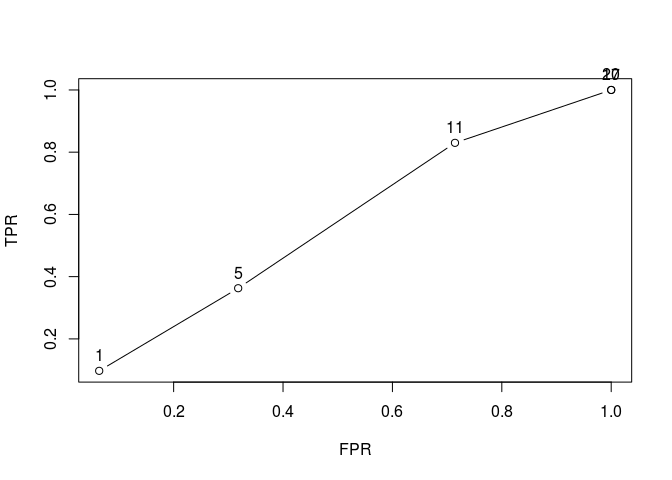

From the figure, we could see that the user based is almost the same for different cases while the popular methods and random items gets better. for the plots we could see that popular items are better at most of the cases the the other two.

plot(results, "prec/rec", annotate=TRUE)
```

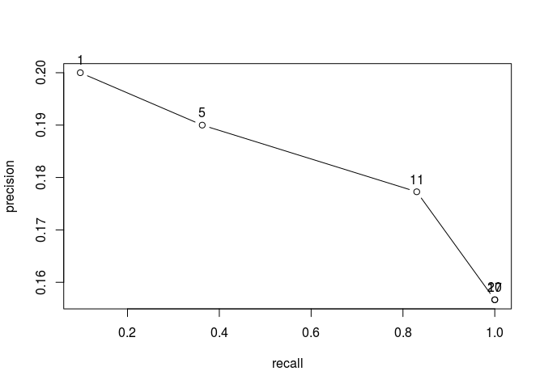

Here we see that the precision( TP / ( TP+FP)) over recall ( TP / (TP+FN)) in increased first but then it falls down. 10 Use the evaluation scheme created above to compare the three recommender algorithms: random items, popular items, and user-based CF based recommendations. Plot the ROC curve and the precision-recall plot with the three methods on each plot. Discuss.

``` r
algorithms <- list(
  "random items" = list(name="RANDOM", param=NULL),
  "popular items" = list(name="POPULAR", param=NULL),
  "user-based CF" = list(name="UBCF", param=list(method="Cosine",
        nn=50, minRating=5))
  )
results <- evaluate(scheme, algorithms, n=sort(sample(sample5,6)))
```

    ## RANDOM run fold/sample [model time/prediction time]
    ##   1  [0sec/0.008sec] 
    ##   2  [0.032sec/0.04sec] 
    ##   3  [0sec/0.008sec] 
    ##   4  [0sec/0.008sec] 
    ##   5  [0sec/0.008sec] 
    ## POPULAR run fold/sample [model time/prediction time]
    ##   1  [0.004sec/0.012sec] 
    ##   2  [0.004sec/0.012sec] 
    ##   3  [0.004sec/0.012sec] 
    ##   4  [0.004sec/0.012sec] 
    ##   5  [0.004sec/0.016sec] 
    ## UBCF run fold/sample [model time/prediction time]
    ##   1

    ## Warning: Unknown parameters: minRating

    ## Available parameter (with default values):
    ## method    =  cosine
    ## nn    =  25
    ## sample    =  FALSE
    ## normalize     =  center
    ## verbose   =  FALSE
    ## [0.044sec/0.012sec] 
    ##   2

    ## Warning: Unknown parameters: minRating

    ## Available parameter (with default values):
    ## method    =  cosine
    ## nn    =  25
    ## sample    =  FALSE
    ## normalize     =  center
    ## verbose   =  FALSE
    ## [0.004sec/0.012sec] 
    ##   3

    ## Warning: Unknown parameters: minRating

    ## Available parameter (with default values):
    ## method    =  cosine
    ## nn    =  25
    ## sample    =  FALSE
    ## normalize     =  center
    ## verbose   =  FALSE
    ## [0sec/0.016sec] 
    ##   4

    ## Warning: Unknown parameters: minRating

    ## Available parameter (with default values):
    ## method    =  cosine
    ## nn    =  25
    ## sample    =  FALSE
    ## normalize     =  center
    ## verbose   =  FALSE
    ## [0.004sec/0.012sec] 
    ##   5

    ## Warning: Unknown parameters: minRating

    ## Available parameter (with default values):
    ## method    =  cosine
    ## nn    =  25
    ## sample    =  FALSE
    ## normalize     =  center
    ## verbose   =  FALSE
    ## [0.004sec/0.012sec]

``` r
plot(results, annotate=c(1,3), legend="topleft")
```

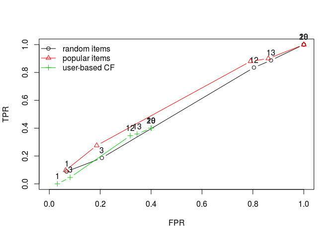

The figure shows that the popular items method and random items method works better than the user-based method because they TPR / FPR are bigger for them.
